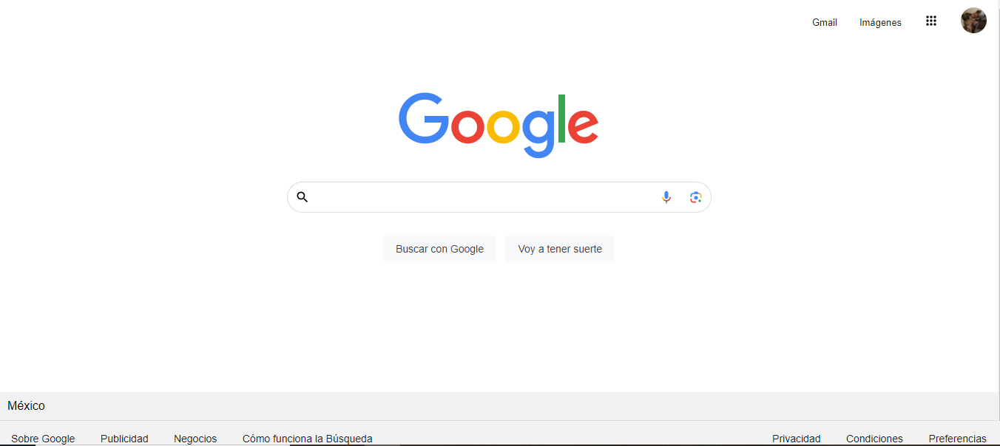

# Clon de Google

El presente proyecto es un Clon de Google desarrollado para poner en práctica las habilidades obtenidad dentro del bootcamp de desarrollo frontend de Technolochicas PRO.
Fue desarrollado con HTML, CSS y JS con el uso de el framework de UI, Bootstrap utilizando además bibliotecas externas.

[Proyecto Desplegado](https://google-one-nu.vercel.app/)

## Secciones de mi Sitio

## Tecnologias 
* HTML
* CSS
---
Desarrollado con amor por Claudia en TECNOLOCHICAS PRO